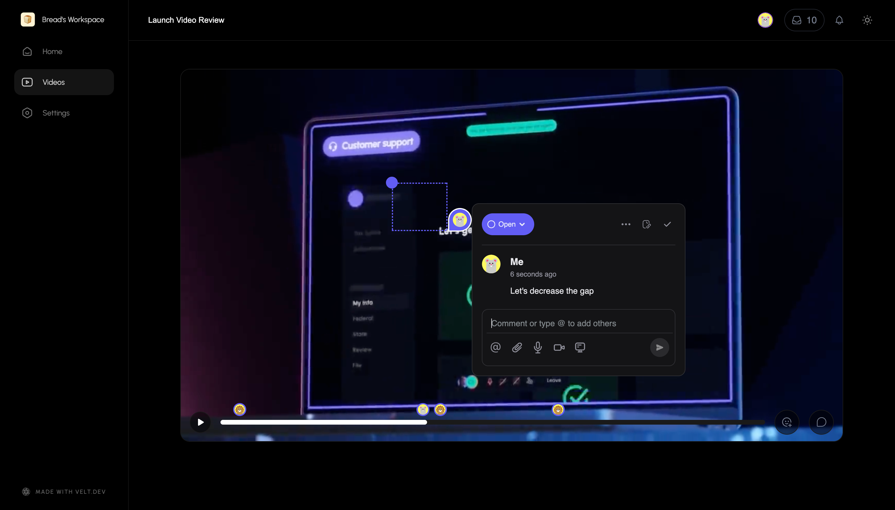

# Commenting on Video Player

In this demo, we are using Velt SDK to add frame by frame comments and reactions on a video player.



## Features Used in Demo

- Comment on Video Timeline
- Reactions
- Presence
- Sidebar
- Notifications

## Installation

To install the Velt Collaboration SDK, you can use npm or yarn. Run one of the following commands in your project directory:

```zsh
npm install @veltdev/client
```

## Docs

- [Video Commmenting](https://docs.velt.dev/async-collaboration/comments/setup/video-player-setup/video-player-setup)
- For everything else read the [documentation](https://docs.velt.dev/get-started/overview) for guides and API References

## Other Links

### Use cases

- [Explore use cases](https://velt.dev/use-case) to learn how collaboration could look like on your product.
- [Figma Template](https://www.figma.com/community/file/1402312407969730816/velt-collaboration-kit): To visualize what collaboration features could look like on your product.

### Releases

- See the latest changes in our [Release Notes](https://docs.velt.dev/release-notes/).

### Security

- Velt is SOC2 Type 2 and HIPAA compliant. [Learn more](https://velt.dev/security)

### Community

- [X](https://x.com/veltjs): To receive updates, announcements, and general Velt tips.
- [Discord](https://discord.gg/GupvcYH27h): Join our community to ask questions and share tips. (Less Active)
